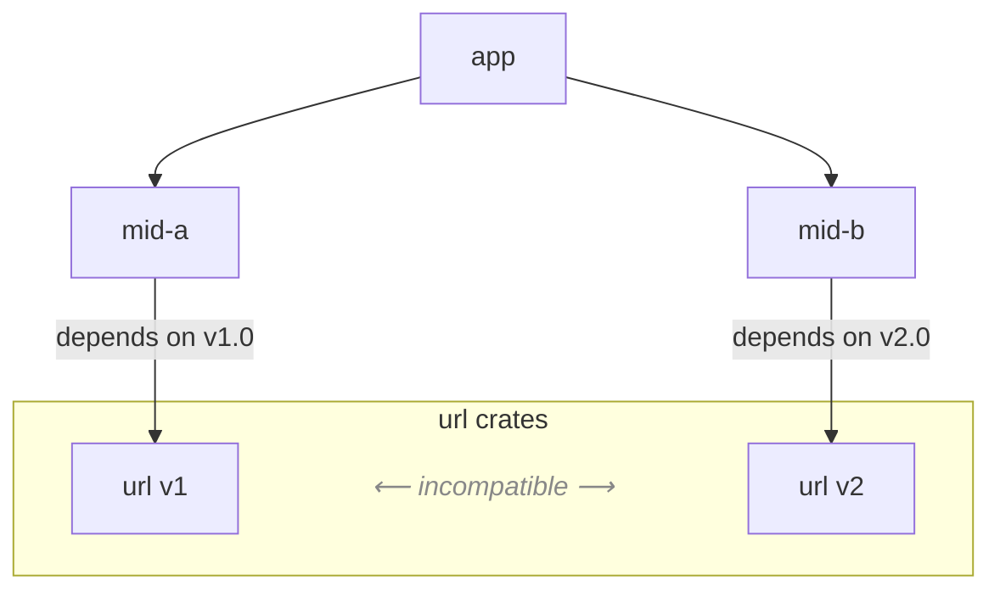

# Name Mangling Problems on Cargo
The Rust package manager Cargo permits multiple versions of the same crate to coexist within a single build. To prevent unintended interactions, Cargo employs **crate name mangling**, assigning each version a distinct identifier and isolating it within a separate namespace. From the perspective of the dependency resolver, this strategy provides a mechanism for satisfying version constraints.  

From the perspective of client code, however, such strategy can change program behavior in two ways:  
- **Type/Trait incompatibility**: crates may export items under identical nominal paths (e.g., `url::Url`), yet these are treated as distinct and incompatible types, even when their structural definitions coincide.
- **Semantic incompatibility**: functions with identical type signatures may exhibit divergent semantic contracts across versions, yielding subtle behavioral incompatibilities that are not detected at compile time.

This repository demonstrates how **Cargo’s name-mangling strategy** (using [`url`](https://crates.io/crates/url) as an example) can lead to such problems.

---

## Project Structure


```
cargo-mangling/
├── mid-a/        # depends on url v1, re-exports url::Url
├── mid-b/        # depends on url v2, re-exports url::Url + extra helpers
└── app/
    └── src/
        └── bin/
            ├── ng1.rs  # compile-time error (type incompatibility)
            ├── ng2.rs  # runtime error (semantic incompatibility)
            ├── ng3.rs  # compile-time error (trait incompatibility)
            ├── ok1.rs  # works (disjoint usage)
            ├── ok2.rs  # works (string bridge, safe)
            └── ok3.rs  # works (explicit conversion to v2 Url)
```

- `mid_a` depends on `url = "1"` and re-exports `url::Url`.  
- `mid_b` depends on `url = "2"` and re-exports `url::Url`, with additional helper APIs.  
- `app` imports both and provides multiple binaries (`src/bin/*.rs`) to demonstrate different scenarios.

## Initial Setup
```bash
cargo build --manifest-path mid-a/Cargo.toml && cargo build --manifest-path mid-b/Cargo.toml
```
## How Can I Check the Duplication?
```bash
$ cargo tree --duplicates
idna v0.1.5
└── url v1.7.2
    └── mid_a v0.1.0 (/home/yudaitnb/cargo-mangling-examples/mid-a)
        └── app v0.1.0 (/home/yudaitnb/cargo-mangling-examples/app)

idna v0.5.0
└── url v2.5.2
    └── mid_b v0.1.0 (/home/yudaitnb/cargo-mangling-examples/mid-b)
        └── app v0.1.0 (/home/yudaitnb/cargo-mangling-examples/app)

percent-encoding v1.0.1
└── url v1.7.2 (*)

percent-encoding v2.3.1
├── form_urlencoded v1.2.1
│   └── url v2.5.2 (*)
└── url v2.5.2 (*)
```

## Scenarios

| Scenario | Mechanism                        | Build | Runtime | Risk profile                | 
| -------- | -------------------------------- | ----- | ------- | --------------------------- | 
| **NG1**  | Type mismatch         | ❌     | –       | **Compile-time safe**, not fixable at the application layer alone. | 
| **NG2**  | Semantic drift across versions | ✅     | ❌       | ❌ **Hard to find the cause**   | 
| **NG3**  | Trait-boound mismatch | ❌     | –       | **Compile-time safe**, not fixable at the application layer alone. | 

```bash
cd app/
cargo build --bin ng1 
cargo build --bin ng2
cargo run --bin ng2
cargo build --bin ng3
```

### NG1 (compile-time type error)

Passing `mid_a::Url` (from `url v1`) into a function expecting `mid_b::Url` (from `url v2`).  
→ Different crate IDs → different types → **compile-time failure**.

```bash
~/app$ cargo build --bin ng1
error[E0308]: mismatched types
  --> src/bin/ng1.rs:3:20
   |
3  |     mid_b::consume(u);
   |     -------------- ^ expected `mid_b::Url`, found `mid_a::Url`
   |     |
   |     arguments to this function are incorrect
   |
note: two different versions of crate `url` are being used; two types coming from two different versions of the same crate are different types even if they look the same
   --> /.cargo/registry/src/index.crates.io-1949cf8c6b5b557f/url-1.7.2/src/lib.rs:154:1
    |
154 | pub struct Url {
    | ^^^^^^^^^^^^^^ this is the found type `mid_a::Url`
    |
   ::: /home/yudaitnb/.cargo/registry/src/index.crates.io-1949cf8c6b5b557f/url-2.5.4/src/lib.rs:227:1
    |
227 | pub struct Url {
    | ^^^^^^^^^^^^^^ this is the expected type `mid_b::Url`
    |
   ::: src/bin/ng1.rs:4:13
    |
4   |     let u = mid_a::make();   
    |             ----- one version of crate `url` used here, as a dependency of crate `mid_a`
...
12  |     mid_b::consume(u);
    |     ----- one version of crate `url` used here, as a dependency of crate `mid_b`
    = help: you can use `cargo tree` to explore your dependency tree
note: function defined here
   --> /home/yudaitnb/cargo-mangling/mid-b/src/lib.rs:2:8
    |
2   | pub fn consume(_u: Url) {}
    |        ^^^^^^^
```

**Observation:** ***Compile-time safe (caught by the type system)***, but surprising when identical-looking type paths come from different crate versions.


### NG2 (semantic mismatch across versions)

The helper `port_or_default` returns `Option<u16>`, but its semantics diverge:  
- In `url v1`, `gopher://` is treated as having a default port `70`.  
- In `url v2.2.0~`, `gopher` is not considered special, so the result is `None` when no port is specified.  

**Note:** This behavioral change is not explicitly mentioned in the `url` crate’s CHANGELOG, but according to the commit history it appears to have been introduced between [v2.2.0](https://docs.rs/url/2.2.0/url/struct.Url.html#method.port_or_known_default) and [v2.1.1](https://docs.rs/url/2.1.1/url/struct.Url.html#method.port_or_known_default).


```bash
~/app$ cargo run --bin ng2
thread 'main' panicked at 'NG2: port_or_default mismatch:
  v1: Some(70)
  v2: None
  src: gopher://example.com/'
```

**Observation:** ***Not compile-time safe***. This mismatch only surfaces at runtime as a failed assertion.


### NG3 (compile-time trait identity mismatch across versions)

A value whose type is expressed via `impl url::form_urlencoded::Target` on the v1 side (from `mid_a`) cannot satisfy a generic bound `T: url::form_urlencoded::Target` on the v2 side (from `mid_b`).
Even though the path looks identical in source, the trait identities differ across versions, so the trait bound is not satisfied.

```bash
~/app$ cargo run --bin ng3
error[E0277]: the trait bound `impl url::form_urlencoded::Target: form_urlencoded::Target` is not satisfied
  --> src/bin/ng3.rs:7:27
   |
 7 |     mid_b::consume_target(t);
   |     --------------------- ^ the trait `form_urlencoded::Target` is not implemented for `impl url::form_urlencoded::Target`
   |     |
   |     required by a bound introduced by this call
   |
   = help: the following other types implement trait `form_urlencoded::Target`:
             &'a mut String
             String
             url::UrlQuery<'a>
note: required by a bound in `consume_target`
  --> /home/yudaitnb/cargo-mangling-examples/mid-b/src/lib.rs:11:26
   |
11 | pub fn consume_target<T: url::form_urlencoded::Target>(mut t: T) {
   |                          ^^^^^^^^^^^^^^^^^^^^^^^^^^^^ required by this bound in `consume_target`
```

**Observation:** ***Compile-time safe (caught by the type system)***, but surprising when identical-looking trait paths come from different crate versions.


## References
- [HOW RUST SOLVED DEPENDENCY HELL](https://stephencoakley.com/2019/04/24/how-rust-solved-dependency-hell)
- [Cargo Book – Registries](https://doc.rust-lang.org/cargo/reference/registries.html)  
- [Cargo Book - Dependency Resolution](https://doc.rust-lang.org/cargo/reference/resolver.html#version-incompatibility-hazards)
- [Can a Rust binary use incompatible versions of the same library?](https://github.com/brannondorsey/rust-incompatible-transitive-dependencies)
- [Issue 22750: Two different versions of a crate interacting leads to unhelpful error messages](https://github.com/rust-lang/rust/issues/22750)
  - [`check_and_note_conflicting_crates`](https://github.com/rust-lang/rust/blob/8401398e1f14a24670ee1a3203713dc2f0f8b3a8/compiler/rustc_trait_selection/src/error_reporting/infer/mod.rs#L393-L398)
- [`cargo-semver-check` Issue "61 - Prepare for merging into cargo](https://github.com/obi1kenobi/cargo-semver-checks/issues/61)
