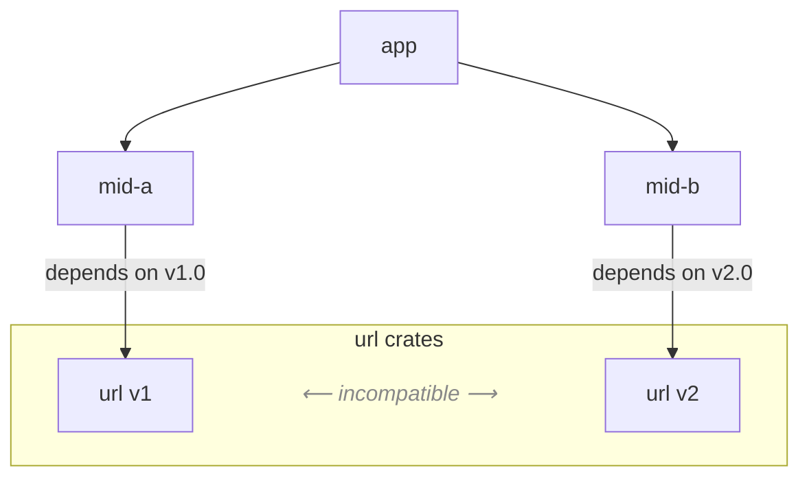

# Name Mangling Problems on Cargo
The Rust package manager Cargo permits multiple versions of the same crate to coexist within a single build. To prevent unintended interactions, Cargo employs **crate name mangling**, assigning each version a distinct identifier and isolating it within a separate namespace. From the perspective of the dependency resolver, this strategy provides a mechanism for satisfying version constraints.  

From the perspective of client code, however, such strategy can change program behavior in two ways:  
- **Type incompatibility**: crates may export items under identical nominal paths (e.g., `url::Url`), yet these are treated as distinct and incompatible types, even when their structural definitions coincide.
- **Semantic incompatibility**: functions with identical type signatures may exhibit divergent semantic contracts across versions, yielding subtle behavioral incompatibilities that are not detected at compile time.

This repository demonstrates how **Cargo’s name-mangling strategy** (using [`url`](https://crates.io/crates/url) as an example) can lead to such problems.

---

## Project Structure


```
cargo-mangling/
├── mid-a/        # depends on url v1, re-exports url::Url
├── mid-b/        # depends on url v2, re-exports url::Url + extra helpers
└── app/
    └── src/
        └── bin/
            ├── ng1.rs  # compile-time error (type incompatibility)
            ├── ng2.rs  # runtime error (semantic incompatibility)
            ├── ok1.rs  # works (disjoint usage)
            ├── ok2.rs  # works (string bridge, safe)
            └── ok3.rs  # works (explicit conversion to v2 Url)
```

- `mid_a` depends on `url = "1"` and re-exports `url::Url`.  
- `mid_b` depends on `url = "2"` and re-exports `url::Url`, with additional helper APIs.  
- `app` imports both and provides multiple binaries (`src/bin/*.rs`) to demonstrate different scenarios.

## Initial Setup
```bash
cargo build --manifest-path mid-a/Cargo.toml && cargo build --manifest-path mid-b/Cargo.toml
```

## Scenarios

| Scenario | Mechanism                        | Build | Runtime | Risk profile                | 
| -------- | -------------------------------- | ----- | ------- | --------------------------- | 
| **OK1**  | Disjoint usage                   | ✅     | ✅       | ⚠ **Hidden version mixture in a program**      | 
| **OK2**  | String bridge                    | ✅     | ✅       | ⚠ **Hidden semantic incompatibility** | 
| **OK3**  | Explicit parse bridge            | ✅     | ✅       | ⚠ **Maintainability risk**  | 
| **NG1**  | Type mismatch         | ❌     | –       | **Compile-time safe**, but too conservative | 
| **NG2**  | Semantic drift across versions | ✅     | ❌       | ❌ **Hard to find the cause**   | 

```bash
cd app/
cargo run --bin ok1
cargo run --bin ok2
cargo run --bin ok3 
cargo build --bin ng1 
cargo build --bin ng2
cargo run --bin ng2
```

### OK1 (disjoint usage)

Use `mid_a::Url` and `mid_b::Url` independently, never crossing them.  
→ Both versions of `url` coexist without issue.

```bash
~/app$ cargo run --bin ok1
   Compiling app v0.1.0 (/home/user/cargo-mangling/app)
    Finished `dev` profile [unoptimized + debuginfo]
     Running `target/debug/ok1`
u1 = https://example.com/
```

**Observation:** As long as the data flows are separated, multiple versions can safely coexist.

### OK2 (string bridge)

Convert `mid_a::Url` to a `String` and pass it across the boundary.  
→ Works, because standard library types like `String` are unaffected by crate versioning.

```bash
~/app$ cargo run --bin ok2
    Finished `dev` profile [unoptimized + debuginfo]
     Running `target/debug/ok2`
```

**Observation:** Stringly-typed bridges preserve compilation, but may hide semantic incompatibility.

### OK3 (explicit type bridge)

Convert the string to `mid_b::Url` immediately via `Url::parse`.  
→ Safe, no hidden mismatch, since everything beyond the conversion uses only `url v2`’s type.

```bash
~/app$ cargo run --bin ok3
    Finished `dev` profile [unoptimized + debuginfo]
     Running `target/debug/ok3`
ok3: bridged mid_a::Url -> mid_b::Url via string (safe)
```

**Observation:** Explicit conversion establishes a clear type boundary and avoids mixed-type flows.

**⚠Note** However, this approach implicitly relies on the stability of `url v1`’s string output and `url v2`’s parser behavior.
Any change in canonicalization (lowercasing, default port removal, percent-decoding) could silently break this bridge.
Thus, while it appears safe at runtime, it carries hidden maintainability risks.

### NG1 (compile-time type error)

Passing `mid_a::Url` (from `url v1`) into a function expecting `mid_b::Url` (from `url v2`).  
→ Different crate IDs → different types → **compile-time failure**.

```bash
~/app$ cargo build --bin ng1
error[E0308]: mismatched types
  --> src/bin/ng1.rs:3:20
   |
3  |     mid_b::consume(u);
   |     -------------- ^ expected `mid_b::Url`, found `mid_a::Url`
   |     |
   |     arguments to this function are incorrect
   |
note: two different versions of crate `url` are being used; two types coming from two different versions of the same crate are different types even if they look the same
   --> /.cargo/registry/src/index.crates.io-1949cf8c6b5b557f/url-1.7.2/src/lib.rs:154:1
    |
154 | pub struct Url {
    | ^^^^^^^^^^^^^^ this is the found type `mid_a::Url`
    |
   ::: /home/yudaitnb/.cargo/registry/src/index.crates.io-1949cf8c6b5b557f/url-2.5.4/src/lib.rs:227:1
    |
227 | pub struct Url {
    | ^^^^^^^^^^^^^^ this is the expected type `mid_b::Url`
    |
   ::: src/bin/ng1.rs:4:13
    |
4   |     let u = mid_a::make();   
    |             ----- one version of crate `url` used here, as a dependency of crate `mid_a`
...
12  |     mid_b::consume(u);
    |     ----- one version of crate `url` used here, as a dependency of crate `mid_b`
    = help: you can use `cargo tree` to explore your dependency tree
note: function defined here
   --> /home/yudaitnb/cargo-mangling/mid-b/src/lib.rs:2:8
    |
2   | pub fn consume(_u: Url) {}
    |        ^^^^^^^
```

**Observation:** This is the *best failure mode*: the incompatibility is caught at compile time. This error is reported by the rustc compiler as being caused by the version selection.

**Note:** However, this also means that the build will fail until `mid_a` is updated. For the `app` developer to use `mid_b`, which depends on version 2 of the `URL` package, they must push the `mid_a` developers to provide an update.

### NG2 (semantic mismatch across versions)

The helper `port_or_default` returns `Option<u16>`, but its semantics diverge:  
- In `url v1`, `gopher://` is treated as having a default port `70`.  
- In `url v2.2.0~`, `gopher` is not considered special, so the result is `None` when no port is specified.  

**Note:** This behavioral change is not explicitly mentioned in the `url` crate’s CHANGELOG, but according to the commit history it appears to have been introduced between [v2.2.0](https://docs.rs/url/2.2.0/url/struct.Url.html#method.port_or_known_default) and [v2.1.1](https://docs.rs/url/2.1.1/url/struct.Url.html#method.port_or_known_default).


```bash
~/app$ cargo run --bin ng2
thread 'main' panicked at 'NG2: port_or_default mismatch:
  v1: Some(70)
  v2: None
  src: gopher://example.com/'
```

**Observation:** The types line up perfectly (`Option<u16>`), yet behavior differs.  
This mismatch only surfaces at runtime as a failed assertion.

## References

- [HOW RUST SOLVED DEPENDENCY HELL](https://stephencoakley.com/2019/04/24/how-rust-solved-dependency-hell)
- [Cargo Book – Registries](https://doc.rust-lang.org/cargo/reference/registries.html)  
- [Cargo Book – Resolver](https://doc.rust-lang.org/cargo/reference/resolver.html)
- [Cargo Book - Dependency Resolution](https://doc.rust-lang.org/cargo/reference/resolver.html#version-incompatibility-hazards)
